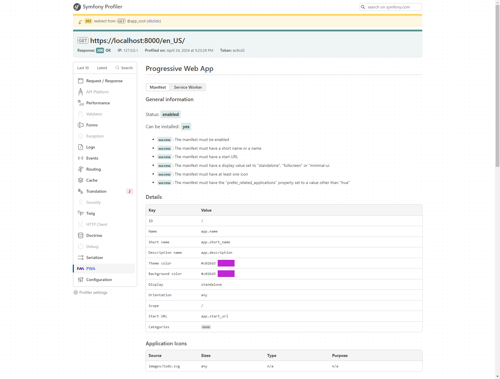

# Development

This page explains how to debug and monitor your PWA during development.

## Debug Toolbar Integration

The bundle integrates with Symfony's Web Debug Toolbar, providing a dedicated PWA panel for inspecting your Progressive Web App configuration.

### What the Toolbar Shows

**Manifest Tab:**
- Current manifest configuration
- App metadata (name, icons, colors, display mode)
- Installability status
- Generated manifest JSON
- Icon verification

**Service Worker Tab:**
- Service worker status and registration
- Caching strategies configured
- Workbox configuration
- Active cache names
- Custom rules applied

**Icons & Assets:**
- Generated icons (all sizes and formats)
- Favicon status
- Screenshot images
- Startup images (iOS)

<figure><figcaption><p>PWA Debug Toolbar - Manifest Tab</p></figcaption></figure>

### Installability Checker

The toolbar includes an installability checker that analyzes your PWA configuration:

✅ **Green status**: App meets installation requirements
⚠️ **Yellow status**: App partially meets requirements (may work on some platforms)
❌ **Red status**: Missing required configuration


Browser installation requirements change frequently. The bundle's installability indicator is a guide, but actual installation availability depends on the browser and platform.


## Service Worker Debugging

Debugging service workers requires a different approach than regular JavaScript.

### Development Mode Features

In development (`APP_ENV=dev`), the service worker includes:

**Verbose Logging:**
- All Workbox operations logged to console
- Cache hit/miss information
- Route matching details
- Background sync status

**Inline Comments:**
- Explanation of each caching strategy
- Route pattern documentation
- Custom rule descriptions

**Source Maps:**
- Easier debugging with readable code
- Stack traces point to actual source

### Browser DevTools

**Chrome/Edge DevTools:**
1. Open DevTools (F12)
2. Go to **Application** tab
3. Select **Service Workers** in the sidebar

From here you can:
- See registration status
- Unregister the service worker
- Update on reload
- Bypass for network
- View cached resources in **Cache Storage**

**Firefox DevTools:**
1. Open DevTools (F12)
2. Go to **Application** tab (or about:debugging#/runtime/this-firefox)
3. View service workers and storage

### Common Debugging Tasks

**Force Service Worker Update:**
```javascript
// In browser console
navigator.serviceWorker.getRegistrations().then(registrations => {
    registrations.forEach(reg => reg.update());
});
```

**Clear All Caches:**
```javascript
// In browser console
caches.keys().then(names => {
    names.forEach(name => caches.delete(name));
});
```

**Check Current Service Worker:**
```javascript
// In browser console
navigator.serviceWorker.controller
```

### Production Mode

In production (`APP_ENV=prod`), the service worker is optimized:

- All debugging code removed
- Comments stripped out
- Minified for smaller file size
- Console logging disabled

This reduces file size and improves performance.

## Logging Configuration

The bundle uses PSR-3 logging to record important events and errors.

### Default Logger

By default, the bundle uses Symfony's default logger channel.

### Custom Logger

Configure a custom logger for PWA-specific logging:


```yaml
pwa:
    logger: 'monolog.logger.pwa'
```


Then define the logger in your Monolog configuration:


```yaml
monolog:
    channels: ['pwa']

    handlers:
        pwa:
            type: stream
            path: '%kernel.logs_dir%/pwa.log'
            level: debug
            channels: ['pwa']
```


### What Gets Logged

The bundle logs:
- Manifest compilation events
- Service worker generation
- Icon processing
- Asset compilation
- Configuration errors
- Runtime warnings

### Logging Levels

- **DEBUG**: Detailed processing information (development only)
- **INFO**: Normal operational messages
- **WARNING**: Non-critical issues (e.g., missing optional config)
- **ERROR**: Critical problems that prevent PWA functionality

## Development Tips

### Testing Offline Mode

**Method 1: Browser DevTools**
1. Open DevTools → Network tab
2. Check "Offline" checkbox
3. Reload the page

**Method 2: Throttling**
1. Open DevTools → Network tab
2. Select "Slow 3G" or "Fast 3G"
3. Test performance with limited connectivity

### Testing Installation

**Desktop:**
1. Open your app in Chrome/Edge
2. Look for install icon in address bar
3. Click to test installation flow

**Mobile:**
1. Visit your app on a real device or emulator
2. Look for "Add to Home Screen" prompt
3. Test the installed app experience

### Cache Inspection

View cached resources:
1. DevTools → Application tab
2. Expand **Cache Storage** in sidebar
3. Click on cache names to see contents
4. Right-click resources to delete

### Manifest Validation

Validate your manifest:
1. DevTools → Application tab
2. Click **Manifest** in sidebar
3. Review all properties
4. Check for warnings or errors

### Testing Updates

Test how your PWA handles updates:

1. Make a change to your service worker config
2. Deploy the update
3. Reload the app
4. Check that service worker updates
5. Verify new version activates

Use `skipWaiting: false` in config to test manual update flows.

## Common Development Issues

### Manifest Not Loading

**Symptoms:** Manifest link appears in HTML but DevTools shows "No manifest detected"

**Solutions:**
1. Clear browser cache
2. Check manifest URL is accessible
3. Verify JSON syntax (use a JSON validator)
4. Ensure `{{ pwa() }}` is in `<head>` section

### Service Worker Not Updating

**Symptoms:** Changes to service worker don't appear

**Solutions:**
1. Hard refresh (Ctrl+Shift+R / Cmd+Shift+R)
2. Click "Update" in DevTools → Application → Service Workers
3. Check "Update on reload" in DevTools
4. Unregister and re-register the service worker

### Install Prompt Not Showing

**Symptoms:** No install option appears

**Check:**
1. HTTPS is enabled (or using localhost)
2. Manifest has required properties
3. Service worker is registered
4. No console errors
5. User engagement criteria met (varies by browser)

### Caching Issues

**Symptoms:** Old content still showing after updates

**Solutions:**
1. Update cache version in service worker config
2. Clear cache storage in DevTools
3. Implement cache expiration strategies
4. Use cache-first only for static assets

## Best Practices for Development

1. **Use HTTPS locally**: Use `symfony serve` with TLS or configure a local SSL certificate
2. **Test on real devices**: Emulators don't perfectly match real device behavior
3. **Monitor console**: Watch for service worker errors and warnings
4. **Clear cache regularly**: Prevent stale data during development
5. **Test offline scenarios**: Ensure graceful degradation
6. **Validate manifest**: Use browser DevTools and online validators
7. **Version your caches**: Update cache names when content changes
