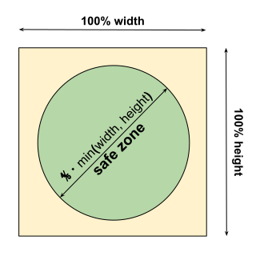
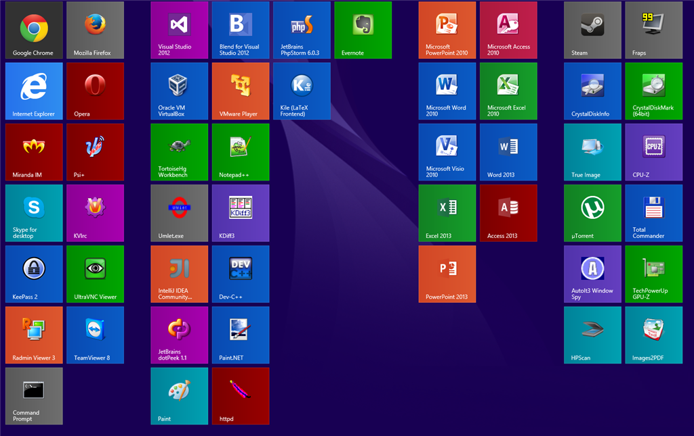

# Create Favicons

Favicons are the small icons that appear in browser tabs, bookmarks, and address bars. Providing favicons that look great across all devices, browsers, and operating systems is traditionally complex and time-consuming.

## Why Favicons Matter

**Brand Recognition:**
- Instant visual identification in crowded browser tabs
- Professional appearance in bookmark lists
- Consistent branding across all platforms

**User Experience:**
- Easier navigation when multiple tabs are open
- Quick identification in browser history
- Better mobile home screen appearance

**Platform Requirements:**
- Each browser and OS expects different sizes
- Multiple formats needed (ICO, PNG, SVG)
- Special icons for touch devices and pinned tabs


Favicons are separate from app icons declared in the Web App Manifest, though they serve similar purposes. The bundle automatically generates both from a single source image.


## Quick Setup

With this bundle, generating all necessary favicons takes just seconds. You only need one source file:

**Requirements:**
- Square icon (recommended)
- SVG format (preferred) or PNG (512x512px minimum)
- Transparent background (highly recommended)

**Basic configuration:**


```yaml
pwa:
    favicons:
        enabled: true
        src: icons/favicon.svg
```


**That's it!** The bundle automatically generates all required favicon sizes and formats for:
- Desktop browsers (16x16, 32x32, 48x48)
- Touch devices (180x180 for Apple, 192x192 for Android)
- Windows tiles (70x70 to 310x310)
- Safari pinned tabs
- And more...

## Icon Source Options

The bundle supports three types of icon sources, giving you flexibility in how you provide your favicon:

### 1. Asset Mapper Asset (Recommended)

Reference icons managed by Symfony's Asset Mapper:

```yaml
pwa:
    favicons:
        src: icons/favicon.svg  # Relative path within assets/
```

**Advantages:**
- Version control friendly
- Automatic cache busting
- Works with build pipeline

### 2. Absolute File Path

Use an existing file from your project directory:

```yaml
pwa:
    favicons:
        src: /app/files/favicon.svg  # Absolute path (starts with /)
```

**Use cases:**
- Files outside the assets directory
- Dynamic file locations
- Legacy icon files

### 3. Symfony UX Icons

Use any icon from the [Symfony UX Icons](https://ux.symfony.com/icons) library:

```yaml
pwa:
    favicons:
        src: bx:cool  # Format: iconset:icon-name
```

**Advantages:**
- No file needed
- Access to thousands of icons
- Consistent icon library

**Popular icon sets:**
- `heroicons:` - Heroicons
- `fa:` - Font Awesome
- `bx:` - BoxIcons
- `lucide:` - Lucide Icons

## Customization Options

### SVG Attributes

You can customize any SVG attribute directly to control how your icon is rendered. The bundle allows you to modify fill colors, stroke properties, and any other SVG root attributes:


```yaml
pwa:
    favicons:
        enabled: true
        src: icons/favicon.svg
        default:
            src: icons/favicon.svg
            svg_attr:
                fill: '#2196f3'      # Set fill color
                stroke: '#ffffff'    # Set stroke color
                stroke-width: '2'    # Set stroke width
```


**Common SVG attributes you can modify:**
- `fill`: Main fill color of the icon
- `stroke`: Outline/border color
- `stroke-width`: Width of the stroke
- `opacity`: Overall transparency
- `color`: Used when SVG uses `currentColor`

**Legacy `svg_color` option:**

For backward compatibility, you can still use `svg_color` (which sets the `color` attribute):

```yaml
pwa:
    favicons:
        enabled: true
        src: icons/favicon.svg
        svg_color: '#15fe68'  # Equivalent to svg_attr.color
```


The `svg_color` option is a shorthand for `svg_attr.color`. Use `svg_attr` directly for more control over SVG rendering.


**Example use cases:**
- Set brand colors for monochrome SVG icons
- Add strokes to improve visibility on backgrounds
- Control opacity for watermark effects
- Modify multiple attributes simultaneously

### Icon Scaling and Safe Zone

Different platforms apply masks to icons (circular, rounded square, etc.). To ensure your icon looks good on all platforms, use the safe zone feature.

**The problem:** Some platforms (especially Android) may crop icons to specific shapes:

<figure><figcaption><p>Safe zone - keep important content within 80% of icon area</p></figcaption></figure>

**The solution:** Scale down your icon to stay within the safe zone:


```yaml
pwa:
    favicons:
        enabled: true
        src: assets/icon.svg
        image_scale: 80 # = 80% of the original size
```


**Recommendations:**
- Use `image_scale: 80` (80%) for icons with text or detailed graphics
- Use `image_scale: 100` for simple, centered logos
- Test on different Android devices to verify appearance


The bundle automatically adds transparent padding to maintain the original canvas size while scaling the icon content.


### Background Color and Rounded Corners

Create polished, platform-native looking icons by adding backgrounds and rounded corners:


```yaml
pwa:
    favicons:
        enabled: true
        src: assets/icon.svg
        background_color: "#ffffff" # Hex color for the icon background
        border_radius: 10 # = 10% of the size. 50% is a circle.
```


**Parameters:**
- `background_color`: Hex color code (e.g., `#ffffff` for white)
- `border_radius`: Percentage of icon size (0-50)
  - `0`: Square corners
  - `10`: Slightly rounded (modern look)
  - `25`: Very rounded
  - `50`: Perfect circle

**Visual examples:**
- `border_radius: 0` → Square icon
- `border_radius: 10` → iOS-like rounded square
- `border_radius: 20` → Android Material style
- `border_radius: 50` → Circle


The `border_radius` option only works when `background_color` is set. Without a background, corners remain transparent.


**Common combinations:**

```yaml
# iOS style
background_color: "#ffffff"
border_radius: 18

# Material Design
background_color: "#2196f3"
border_radius: 20

# Circular icon
background_color: "#000000"
border_radius: 50
```

### Dark Mode Icons

Support dark themes with dedicated dark mode icons. Modern devices automatically switch between light and dark icons based on system theme:


```yaml
pwa:
    favicons:
        enabled: true

        # Light mode icon (shown in light theme)
        default:
            src: assets/icon.svg
            background_color: '#ffffff'

        # Dark mode icon (shown in dark theme)
        dark:
            src: assets/icon_dark.svg
            background_color: '#000000'
```


**How it works:**
- `default`: Light theme icon (used when system is in light mode)
- `dark`: Dark theme icon (used when system is in dark mode)
- Browser automatically switches based on user's system theme preference

**Benefits:**
- Better user experience in dark mode
- Maintains brand visibility in all themes
- Professional, modern appearance
- Automatic theme switching

**Example scenarios:**
- Light background icon for light mode, dark background for dark mode
- Inverted color scheme for better contrast
- Different icon variants optimized for each theme


When `dark` is defined, `default` becomes the light mode variant. Without `dark`, `default` is used for both themes.


## Platform-Specific Features

### Safari Pinned Tab Icon

Safari's pinned tabs use a special monochrome icon. Configure it with a single color:


```yaml
pwa:
    favicons:
        enabled: true
        src: assets/icon.svg
        safari_pinned_tab_color: "#f5ef06" # Safari only
        use_silhouette: true
        potrace: "/path/to/potrace" #Optional.
        # Only if potrace is installed in a non-conventional folder
```


**Icon rendering:**
- By default, uses your icon as-is (with background/border-radius if configured)
- Set `use_silhouette: true` for a clean silhouette effect

**Silhouette mode:**

Generates a single-color silhouette of your icon, perfect for Safari's minimalist pinned tab design.


Silhouette mode requires [potrace](https://en.wikipedia.org/wiki/Potrace) to be installed on your system. Install it via your package manager (e.g., `apt install potrace` on Debian/Ubuntu).


**Custom potrace path:**

If potrace is installed in a non-standard location:

```yaml
pwa:
    favicons:
        potrace: "/usr/local/bin/potrace"  # Custom path
```

### Windows Tiles

Enable special tiles for Windows 8/10 Start Menu and taskbar:


```yaml
pwa:
    favicons:
        enabled: true
        src: assets/icon.svg
        tile_color: "#f5ef06" # Windows 8 to 10 only
```


<figure><figcaption><p>Windows 8/10 tiles with custom tile color</p></figcaption></figure>

**What gets generated:**
- Small tile (70x70)
- Medium tile (150x150)
- Wide tile (310x150)
- Large tile (310x310)


Windows tiles ignore `background_color` and `border_radius` options. The tile color is applied as a flat background by Windows itself.


**Use cases:**
- Windows desktop applications
- Corporate environments using Windows
- Apps pinned to Windows Start Menu

## Legacy Browser Support

### Low Resolution Icons

By default, the bundle generates icons optimized for modern devices. Enable additional icon sizes for legacy browsers and older devices:


```yaml
pwa:
    favicons:
        enabled: true
        src: assets/icon.svg
        low_resolution: true
```


**Additional sizes generated:**
- 16x16 (very old browsers)
- 24x24 (Windows XP)
- 32x32 (standard favicon)
- 64x64 (high-DPI favicon)
- 96x96 (Google TV)
- 128x128 (Chrome Web Store)

**When to enable:**
- Supporting iOS 6 or older
- Chrome 20 or older browsers
- Legacy Android devices (pre-4.3)
- Enterprise environments with old hardware


Enabling `low_resolution` increases compilation time and generates more files. Only enable if you need legacy browser support.


## Complete Configuration Example

Here's a comprehensive configuration showing both modern and legacy formats:

### Modern Configuration (Recommended)


```yaml
pwa:
    favicons:
        enabled: true

        # Light mode theme
        default:
            src: assets/icon.svg
            background_color: '#ffffff'
            border_radius: 18
            image_scale: 80
            svg_attr:
                fill: '#2196f3'
                stroke: '#ffffff'

        # Dark mode theme
        dark:
            src: assets/icon_dark.svg
            background_color: '#000000'
            border_radius: 18
            image_scale: 80
            svg_attr:
                fill: '#ffffff'
                stroke: '#2196f3'

        # Platform-specific
        safari_pinned_tab_color: '#2196f3'
        use_silhouette: true
        tile_color: '#2196f3'

        # Additional options
        use_start_image: true
        low_resolution: false
        potrace: 'potrace'  # Path to potrace binary
```


### Legacy Configuration (Still Supported)

For backward compatibility, the legacy format still works:


```yaml
pwa:
    favicons:
        enabled: true

        # Source (will be converted to default.src)
        src: assets/icon.svg
        svg_color: '#2196f3'  # Converted to default.svg_attr.color
        background_color: '#ffffff'

        # Styling
        border_radius: 18
        image_scale: 80

        # Dark mode
        src_dark: assets/icon_dark.svg
        background_color_dark: '#000000'

        # Platform-specific
        safari_pinned_tab_color: '#2196f3'
        use_silhouette: true
        tile_color: '#2196f3'
```



**Deprecated:** The legacy format is deprecated and will be removed in version 2.x.

Deprecated options:
- `src` → use `default.src`
- `svg_color` → use `default.svg_attr.color` or `svg_attr`
- `background_color` → use `default.background_color`
- `src_dark` → use `dark.src`
- `background_color_dark` → use `dark.background_color`
- `border_radius` → use `default.border_radius` and/or `dark.border_radius`
- `image_scale` → use `default.image_scale` and/or `dark.image_scale`

Migrate to the `default` and `dark` structure for full control and future compatibility.


## Best Practices

1. **Use SVG when possible**: Scales perfectly to all sizes without quality loss
2. **Transparent backgrounds**: Works on any platform background color
3. **Simple designs**: Complex details may not be visible at small sizes (16x16)
4. **Test safe zone**: Ensure important elements stay within 80% of icon area
5. **Dark mode support**: Provide dark icons for better user experience
6. **Skip legacy support**: Unless you have specific requirements, modern icons are sufficient

## Troubleshooting

### Icons not appearing

**Check:**
1. Icon file exists at specified path
2. File format is supported (SVG, PNG)
3. Compilation ran successfully (`pwa:compile`)
4. HTML includes `{{ pwa() }}` function

### Icon quality issues

**Solutions:**
- Use SVG instead of PNG for better scaling
- Ensure PNG is at least 512x512 pixels
- Use `image_scale` to add safe zone padding
- Test on actual devices

### Silhouette not generating

**Requirements:**
- `potrace` must be installed
- Icon must have clear shapes (not gradients)
- Use `potrace` parameter if in custom location

### Dark icons not switching

**Verify:**
- Device/browser supports dark mode
- Both `default` and `dark` sections are configured
- Icons have been recompiled
- System theme is actually changing (test in browser DevTools)

## What Gets Generated

When you compile favicons, the bundle creates:

**Standard favicons:**
- `favicon.ico` (multi-size ICO file)
- `favicon.svg` (for modern browsers)
- `apple-touch-icon.png` (180x180 for iOS)
- `icon-192.png`, `icon-512.png` (for Android)

**HTML tags injected by `{{ pwa() }}`:**
```html
<link rel="icon" type="image/svg+xml" href="/favicon.svg">
<link rel="icon" type="image/png" sizes="192x192" href="/icon-192.png">
<link rel="apple-touch-icon" sizes="180x180" href="/apple-touch-icon.png">
<link rel="mask-icon" href="/safari-pinned-tab.svg" color="#2196f3">
<meta name="msapplication-TileColor" content="#2196f3">
```

All files are automatically optimized and cached for production.
